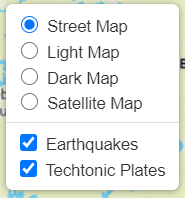

# Leaflet Homework - Visualizing Data with Leaflet

 

Welcome to my project repo! 
You can visit the website [here](https://kirstiemccown.github.io/Plot.ly-Homework/), or feel free to take a look around the repo folders! 
When you visit the website, you will find an interactive map where you can observe information about earthquakes and techtonic plates!

If you are interested, you can find out more information about the data here: 
* [USGS GeoJSON Feed](http://earthquake.usgs.gov/earthquakes/feed/v1.0/geojson.php)
* [Techtonic Plates](https://github.com/fraxen/tectonicplates)  

## About the Map

The USGS provides earthquake data in a number of different formats, updated every 5 minutes. The dataset that has been utilised in this project is 'All Earthquakes from the Past 7 Days'. When visiting the USGS GeoJSON Feed you can see a JSON representation of datasets available. I have used the URL of this ('All Earthquakes from the Past 7 Days') JSON to pull in the data for visualization for this project.

I have created a map using Leaflet that plots all of the earthquakes from the USGS data set based on their longitude and latitude, and also visualised each earthquake based on magnitude (relative size shown on the map) and depth (colour). 

Alongside the data from USGS, a second dataset has been utilised, in order to illustrate the relationship between tectonic plates and seismic activity.   

<h3>Base & Overlay Layers</h3>

  

When visualising the map, you can turn on and off layers to see earthquake data, techtonic plates or both. 
There is also a number of base layer maps that can be utilised depending on your preference. 
As a default, the street map, earthquake and techtonic plates will all be loaded into the map when first opened, and can be turned on and off as you wish.   

<h3>Legend</h3>

  

When visualising the map, each of the earthquake markers (cirlces) are identified by 2 properties. The size of the marker, relates to the size of magnitude and the colour relates to the depth of the earthquake as seen on the legend positioned in the bottom right hand corner of the map.   

<h3>Markers</h3>

  

When visualising the map, each of the earthquake markers (cirlces) can be clicked to visualise more infomration about the earthquake such as a description of the location, magnitude and depth.   

### Created With

This project was created using the following: 
* Leaflet
* Mapbox
* D3
* JavaScript
* Bootstrap
* HTML
* CSS

